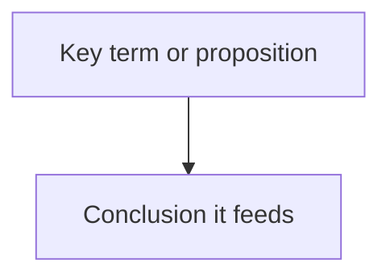

# Note templates

Copy-paste these into the workspace and fill them in as you go. Bracketed text
like `[unity statement]` marks what to write; delete the brackets once filled.
Papers use `sec01-<slug>.md` instead of `ch01-<slug>.md` in `notes/` — see
[paper-mode.md](paper-mode.md) for how section notes differ from chapter notes.

## Citation rules

These apply to every template below — `verify-quotes.sh` only recognizes
citations in these exact forms, and a citation it can't parse is a citation
it silently skips, not one it flags.

- Cite pages as `(p. N)`, `(pp. A-B)`, or `(tr. N)` (Vietnamese) — nothing
  else. A note citing `(src 53)` or `p53` looks fine to a human and is
  invisible to the checker.
- Never put a quote or its page cite inside a Mermaid or code fence — the
  checker skips fenced blocks entirely, so a quote parked there never gets
  checked either.
- No ellipses inside quotation marks. Quote the longest contiguous verbatim
  run instead of stitching two spans together — a stitched quote won't match
  the source text even when both halves are real.
- If PDF extraction garbled the passage (two-column pull-quotes, crop-mark
  artifacts, hyphenation breaks), don't patch the garbled text into a
  "quote" — paraphrase it with a page cite instead.

## map.md — inspectional pass (Step 2)

```markdown
# Map: [Book title]

- **Author**: [name]
- **Edition/year**: [year, edition, translator if relevant]
- **Pages**: [total pages, from prepare-text.sh]
- **Page offset**: [e.g. "printed page = source page − 22" — record this
  during the inspectional pass by comparing a printed page number you can see
  against its `[[page N]]` position in source.txt; skip if synthetic_pages]

## Classification

- **Kind**: [theoretical (explains what is) / practical (prescribes what to do)]
- **Genre**: [history, science, philosophy, self-help, textbook, novel, ...]

## The whole-book question

[The single question this book is trying to answer. One sentence.]

## Unity statement

[What the book is about, in no more than 3 sentences. If you can't compress it
this far, you don't understand the book's unity yet — keep reading the
front/back matter before moving on.]

## Structure

| Part/Chapter | Pages | Title | Role in the argument |
| --- | --- | --- | --- |
| ch01 | 9–34 | [title] | [what this chapter does for the whole] |

<!-- diagram:start -->
<!-- build-diagram.sh --append writes the Mermaid mindmap here; don't hand-edit
     between these markers, re-run the script instead -->
<!-- diagram:end -->

## High-value chapters for this reading

Ranked against the stated reading purpose: "[purpose]"

1. ch0N — [why it matters to the purpose]
2. ch0N — [why it matters to the purpose]

## Mode and plan

- **Mode chosen**: overview | study
- **Plan**: [which chapters get a full analytical pass, which get skimmed]
```

## notes/chNN-\<slug\>.md — analytical pass (Step 3)

One file per chapter. Write it right after reading the chapter, then Recite
against the chapter text before moving to the next one.

```markdown
# ch0N: [chapter title] (pp. [from]–[to])

## Question this chapter answers

[The chapter-level question, in the author's terms.]

## Key terms

| Term | First used | Author's meaning |
| --- | --- | --- |
| [term] | p. [N] | [meaning as the author uses it here] |

*(mirror each row into the workspace's terms.md ledger too)*

## Leading propositions

- [The chapter's main claims, one per line, each with a page cite]

## Arguments

- **Premises**: [p. N] [premise] + [p. N] [premise]
  **Conclusion**: [p. N] [conclusion]

## Evidence offered

- [data, cases, citations the author uses to support the claims — p. N each]

## Quotes

- "[exact quote text]" (p. N)

## Tensions / links to other chapters

- [Where this chapter agrees, conflicts with, or depends on another chapter]

## Open questions

- [Anything unresolved, unclear, or worth flagging for synthesis]
```

## terms.md — cross-chapter ledger

Start this file in Step 2 and add a row every time Step 3 introduces or
reuses a key term. It's what later sessions grep first when answering a
follow-up question.

```markdown
# Key terms

| Term | Defined at (p.) | Author's meaning | Evolves / reused at |
| --- | --- | --- | --- |
| [term] | p. [N] | [the author's specific meaning, not a dictionary def] | ch03 p.55 (extended to...), ch07 p.102 (contrasted with...) |
```

## synthesis.md — Step 4 and Step 5

```markdown
# Synthesis: [Book title]

Reading purpose: "[purpose]"

## 1. What is the book about as a whole?

[Answer, page-cited where it draws on specific chapters.]

## 2. What is said in detail, and how?

[The book's argument structure, drawing on notes/ and terms.md, not the raw
text. Page-cite load-bearing claims.]

## 3. Is it true, in whole or in part?

[Judgment per the Critical judgment section of SKILL.md — distinguish "wrong
here (p. N, because...)" from "incomplete" from "cannot verify".]

## 4. What of it?

[Answered specifically against the stated reading purpose — what this means
for what the user is actually trying to do, not a generic "this book matters
because..."]

## Concept map



*(hand-authored from terms.md + chapter notes — see SKILL.md Step 4 for why
this can't be generated mechanically)*

## Verification log

Mechanical check: `verify-quotes.sh` — [N] checked, [N] ok, [N] near, [N] fail
→ [all fixed / remaining issues and why they're acceptable]

Hand-verified paraphrased claims (5–10 most load-bearing):

- ✓ verified — [claim] (p. N) — [what re-reading confirmed]
```
